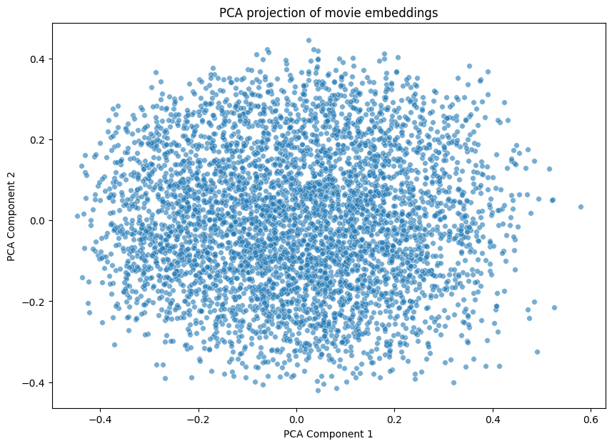
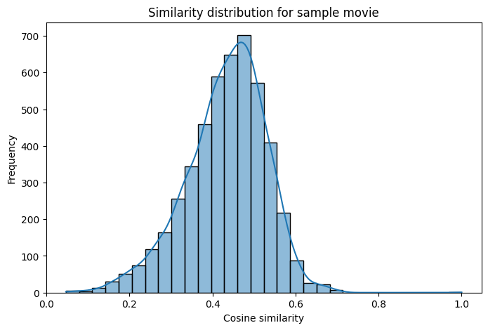
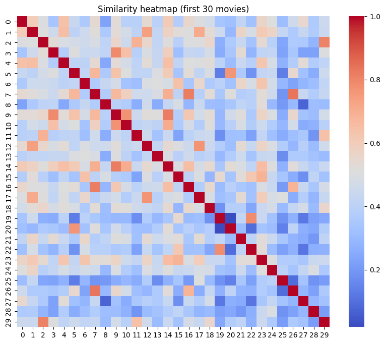

# Movie-Recommendations


# Movie Recommendation System Using Semantic Search & Embeddings

## Overview

This project implements a movie recommendation system that takes a user input sentence describing their movie preferences and returns the top 5 most semantically similar movies from the TMDB dataset. It uses modern natural language processing techniques with pre-trained transformer-based embeddings to understand the meaning behind user queries and find relevant films, not just by keyword matching but by semantic similarity.

---

## How to Use

--

## Installation and Run (without cloning)

1 **Install dependencies**

Make sure you have **Python 3.7+** installed.
Then run:

```bash
pip install -r requirements.txt
```

➥ Here’s a `requirements.txt` you can use:

```txt
pandas
numpy
scikit-learn
sentence-transformers
matplotlib
seaborn
```

---

2 **Download the dataset**

Download the TMDB movie metadata and credits datasets from Kaggle:

* [TMDB Movie Metadata](https://www.kaggle.com/datasets/tmdb/tmdb-movie-metadata)

Save `tmdb_5000_movies.csv` and `tmdb_5000_credits.csv` into your **current directory** (say, `.`).

---

3 **Run the recommendation script**

Open `Python` or **Google Colab**, put your code (like `recommend.py`) in the directory with the CSV files, then run:

```bash
python recommend.py
```

Or if you’re using **Jupyter/Colab**, simply execute the cells in your notebook.

---

4 **Enter your movie preference**

When prompted, input a sentence describing the kind of movie you’d like to watch.
For example:

```
I love fantasy adventure movies
```

The system will respond by displaying **the top 5 recommended movies with their summaries and poster images**.

---


## Project Structure

* `recommend.py`: Main script that loads data, computes embeddings, and handles recommendations.
* `data/`: Folder containing datasets.
* `plots/`: (Optional) Folder with analysis plots.

---

## Technology & Libraries Used

* **Python 3.7+**
* **Pandas**: For data manipulation.
* **Sentence Transformers** (`sentence-transformers`): To generate semantic embeddings from text.
* **Scikit-learn**: For similarity computations.
* **Matplotlib/Seaborn**: For data visualization.
* **Requests & PIL**: For fetching and displaying poster images.
* **IPython.display**: For image display in notebooks.

---

## Data Analysis and Visualizations

To better understand the structure of our movie embeddings and their relationships, we performed a few key analyses:

### 1 PCA Projection (Scatter Plot)

To visualize high-dimensional embeddings in a 2D space, we applied **Principal Component Analysis (PCA)** to reduce the dimensions from 768 to 2.  
This lets us plot all the movies in a scatter plot.  
Movies that are close together in this space tend to be semantically similar in their content.



### 2 Distribution of Similarities ( Histogram )

We also examined the distribution of cosine similarity scores between a sample movie and all other films.  
This shows us whether most films are dissimilar or if there are many close neighbors.  
A large peak at low similarity suggests that most films are not related, while a small peak at high similarity signals a small set of very similar films.



### 3 Heatmap of Similarities

To visualize pairwise similarity amongst a small set of films, we constructed a **heatmap**.  
Here, each cell shows how close two films are in semantic space.  
This highlights clusters of related films — groups with higher similarity form block-like structures on the diagonal.



---

These visualization techniques collectively help us:
- Validate the semantic representation of our embeddings.
- Identify clusters or groups of related films.
- Better interpret the results of our recommender algorithm.


---

## How the Code Works

1. **Loading Data**:
   The TMDB movie metadata and credits datasets are loaded and merged on the `id` column to enrich movie information.

2. **Text Preprocessing**:
   Relevant textual fields such as movie titles and overviews are combined to form a single text input for embedding.

3. **Embedding Generation**:
   The `sentence-transformers` library with the `"all-mpnet-base-v2"` model is used to convert movie descriptions and user queries into high-dimensional vectors that capture semantic meaning.

4. **Similarity Search**:
   Using cosine similarity, the user input vector is compared against all movie vectors to find the closest matches.

5. **Results Display**:
   Top 5 matching movies are returned with titles, overviews, and poster images (if available).

---

## References

* [TMDB Dataset on Kaggle](https://www.kaggle.com/datasets/tmdb/tmdb-movie-metadata)
* [Sentence Transformers Documentation](https://www.sbert.net/)
* [TMDB API for Posters](https://developers.themoviedb.org/3/getting-started/introduction)
* [Cosine Similarity in Scikit-learn](https://scikit-learn.org/stable/modules/generated/sklearn.metrics.pairwise.cosine_similarity.html)

---

## Future Improvements

* Integrate TMDB API to fetch real-time poster images and trailers.
* Build a web-based UI with frameworks like Streamlit or Gradio for better user experience.
* Expand dataset to include user reviews and genres for richer recommendations.
* Add caching for embeddings to speed up repeated queries.

---

Thank you for checking out this project! Feel free to contribute or raise issues.


